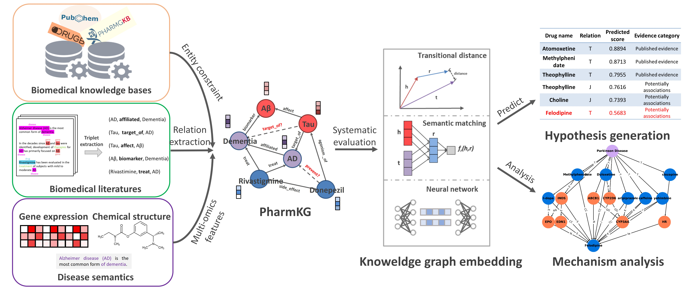

# PharmKG

The code for the paper: PharmKG -- A Dedicated Knowledge Graph Benchmark for Biomedical Data Mining

The code was partly built based on [Pykeen](https://github.com/pykeen/pykeen) and [KG-reeval](https://github.com/svjan5/kg-reeval). Thanks a lot for their code sharing!


## Copyright 
The initial development was made by Aladdin Healthcare Technologies Ltd., Sun Yat-sen University and Mind Rank AI.
All Rights Reserved.


## Overview
PharmKG is a multi-relational, attributed biomedical knowledge graph, comsed of more than 500 thousands individual interconnectons between genes, drugs and diseases, with 29 relation types over a vocabulary of ~8000 disambiguated entites.


<!-- ### (Result) -->


## PharmKG Dataset

Raw dataset of PharmKG was hosted on [zenodo](https://zenodo.org/record/4077338).
And in the experiments we used the cleaned PharmKG-8K dataset. 
The detailed information can be found in [PharmKG_original.zip](https://drive.google.com/file/d/1yexL-SBzWxxIbc1zsalCVOntJ1CKaKcJ/view?usp=sharing) 

#### Dataset summary
|Dataset|Train|Test|Valid|Entities|Triplets|
|:-:|:-:|:-:|:-:|:-:|:-:|
|PharmKG-8k|400788|49536|50036|7601|500958|
|PharmKG-Raw|-|-|-|188296|1093236|

#### Entities distribution
|Type|DrugBank|TTD|OMIM|PharmGKB|GNBR|PharmKG|
|:-:|:-:|:-:|:-:|:-:|:-:|:-:|
|Chemical|1208|1347|-|615|1442|1497|
|Disease|-|399|987|419|1001|1346|
|Gene|1166|741|2320|1674|4716|4758|

#### Performance on PharmKG
<table>
   <tr>
      <th rowspan="2">Category</td>
      <th rowspan="2">Model</td>
      <td></td>
      <th colspan="5">Hits@N</td>
   </tr>
   <tr>
      <th>MRR</td>
      <th>N=1</td>
      <th>N=3</td>
      <th>N=10</td>
      <th>N=100</td>
   </tr>
   <tr>
      <th rowspan="2">Distance-Based</td>
      <th>TransE</td>
      <td>0.091</td>
      <td>0.034</td>
      <td>0.092</td>
      <td>0.198</td>
      <td>0.524</td>
   </tr>
   <tr>
      <th>TransR</td>
      <td>0.075</td>
      <td>0.030</td>
      <td>0.071</td>
      <td>0.155</td>
      <td>0.510</td>
   </tr>
   <tr>
      <th rowspan="3">Semantic Matching</td>
      <th>RESCAL</td>
      <td>0.064</td>
      <td>0.023</td>
      <td>0.057</td>
      <td>0.122</td>
      <td>0.413</td>
   </tr>
   <tr>
      <th>ComplEx</td>
      <td>0.107</td>
      <td>0.046</td>
      <td>0.110</td>
      <td>0.225</td>
      <td>0.552</td>
   </tr>
   <tr>
      <th>Distmult</td>
      <td>0.063</td>
      <td>0.024</td>
      <td>0.058</td>
      <td>0.133</td>
      <td>0.461</td>
   </tr>
   <tr>
      <th rowspan="3">Neural Network</td>
      <th>ConvE</td>
      <td>0.086</td>
      <td>0.038</td>
      <td>0.087</td>
      <td>0.169</td>
      <td>0.425</td>
   </tr>
   <tr>
      <th>ConvKB</td>
      <td>0.106</td>
      <td>0.052</td>
      <td>0.107</td>
      <td>0.209</td>
      <td>0.548</td>
   </tr>
   <tr>
      <th>RGCN</td>
      <td>0.067</td>
      <td>0.027</td>
      <td>0.062</td>
      <td>0.139</td>
      <td>0.236</td>
   </tr>
   <tr>
      <th rowspan="2">Proposed</td>
      <th>HRGAT –w/o</td>
      <td>0.138</td>
      <td>0.068</td>
      <td>0.148</td>
      <td>0.275</td>
      <td>0.586</td>
   </tr>
   <tr>
      <th>HRGAT</td>
      <td>0.154</td>
      <td>0.075</td>
      <td>0.172</td>
      <td>0.315</td>
      <td>0.649</td>
   </tr>
</table>

## Manual
### Installation

Under the "PharmKG-D/model/pykeen/pykeen" directory, type `python setup.py install --user` to compile the pykeen package.

### Data Preprocessing

Run code `python PharmKG-D/data/preprocess.py`

The data for the preprocess.py can be found  [here](https://drive.google.com/file/d/1ENbc7zvthVoYfD7KfVXIriEUdi9Adk_O/view?usp=sharing) 

The embedding data can be found [here](https://drive.google.com/drive/folders/1IZC5658CzEBeAfQE4CE5odF2Zv9QHzj3?usp=sharing) 

### Competitive Models
#### Model in Pykeen

`TransE`, `TransR`, `DistMult`, `ComplEx`, `RESCAL`

#### Training

Run code `python PharmKG-D/model/pykeen/train.py --model <model_name> --save_path <path>` under the root directory of this repository.  `<model_name>` is name of the model you are going to train. `<path>` is the path to a json file containing the output results.

#### Neural network-based Model

`ConvE`, `ConvKB`, `HRGAT`

#### Training
Model training can be started by running the following scripts:

ConvE:
```sh
sh PharmKG-D/model/ConvE/run.sh
```
ConvKB:
```sh
sh PharmKG-D/model/ConvKB/run.sh
```
HRGAT:
```sh
sh PharmKG-D/model/HRGAT/run.sh
```

<!-- ### Hyperparameter Optimization

We used default hyperparameters in package `pykeen`. If you want to try , please modify the hyperparameters in file `PharmK-D/model/pykeen/train.py`.  -->


